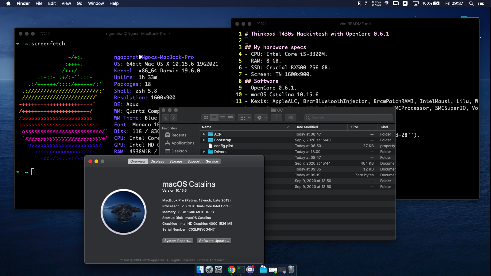

# Thinkpad T430s Hackintosh with OpenCore 0.6.1

## My hardware specs
- CPU: Intel Core i5-3320M.
- RAM: 8 GB.
- SSD: Crucial BX500 256 GB.
- Screen: TN 1600x900.
## Software
- OpenCore 0.6.1.
- macOS Catalina 10.15.6.
- Kexts: AppleALC, BrcmBluetoothInjector, BrcmPatchRAM3, IntelMausi, Lilu, WhatEverGreen, VirtualSMC, SMCBatteryManagement, SMCProcessor, SMCSuperIO, VoodooInput, VoodooPS2Controller. 
## What's working (as I have tested so far)
- Intel HD Graphics 4000 w/ QE-CI.
- Sound output and intergrated microphone (``alcid=28``).
- Keyboard.
- Backlight control via ``Fn-F8/F9``.
- TrackPoint and TrackPoint buttons.
- Battery status.
- USB ports.
## Not working well
- Touchpad.
## Not working
- Intergrated Wifi and Bluetooth.
- Touchpad lower buttons.
- VGA output.
- Hard disk LED (it turns on forever, no blinking, etc.).
## Not tested
- DisplayPort output (shown in Hackintool).
- Intergrated camera (it's broken on my laptop).
- Sleep/wake.
## Changelog
```
11-Sep-2020: initial build
```
## Special thanks
- OpenCore, macOS and other tools' developer team.
- This DSDT patching guide for T430s: https://www.tonymacx86.com/threads/guide-lenovo-thinkpad-t430-clover.229576/

